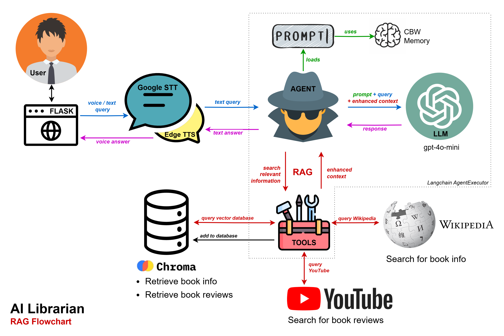

# AI Librarian
*Ironhack bootcamp - Final Project (November 2024)*  


## Project Description
Meet Alice, your personal AI Librarian. Alice is a robust conversational chatbot created to answer user queries about books and litterature in general, search a vector database, fetch book information from Wikipedia, and retrieve transcripts of book reviews from YouTube. This architecture allows it to provide accurate and up-to-date information on various topics. The integration of a personality element, language models, and tools enables it to act as a virtual librarian with a rich user experience.

See project slides in the `presentation` folder for project overview.

## Demo

https://github.com/user-attachments/assets/126a8f59-b56e-4f04-9a4b-320fd9306fd6

## Flowchart
This project is a chatbot-powered digital librarian designed to assist users in finding information about various topics. It leverages a combination of an AI agent, Retrieval-Augmented Generation (RAG), and several tools to provide informative and contextually relevant responses.




## Installation
This project was developped and tested on windows 11 x64 and `python 3.12.7`.  
Clone the repository and setup a virtual environment as follows.

1. **Clone the repository**:

    ```bash
    git clone https://github.com/alexdjulin/ik-multimodal-ai-librarian.git
    cd ik-multimodal-ai-librarian
    ```

2. **Set up a virtual environment**:

    ```bash
    python -m venv venv
    source venv/bin/activate  # For Windows, use venv\\Scripts\\activate
    ```

3. **Install dependencies**:

    ```bash
    pip install -r requirements.txt
    ```

4. **Set up environment variables**:

    Rename `template.env` to `.env` and set up your environment variables (like API keys) as necessary.

5. **Launch the web application**:

    ```bash
    python app.py
    ```
    You can now access the app at your [localhost address](http://127.0.0.1:5000/).


## Repository Structure

### Core Application
- **app.py**: The main application file to launch the Flask web server.

- **ai_librarian.py**: The main class to build the chatbot agent.

- **models.py**: Defines the agent model and additional sub-models used to generate the answers.

- **config_loader.py**: A helper module to load configuration from `config.yaml`.

- **helpers.py**: Contains utility functions for additional support operations.
  
- **logger.py**: Logger setup and configurations.
  
- **vector_db.py**: Handles vector database interactions.

- **static**: Folder containing files for the web interface, such as CSS and JavaScript.

- **templates**: Folder containing the HTML templates for the Flask web interface.
  
### Setup Files
- **prompt.jsonl**: JSONL file for managing prompt messages used in responses.

- **config.yaml**: Configuration file listing all project settings.

- **requirements.txt**: List of Python libraries required to run the project.

- **template.env**: Template for environment variables. Rename it to `.env` and add API keys and other sensitive information to it.

### Notebooks
- **load_dataset_to_db.ipynb**: Notebook to load the [Books Dataset](https://www.kaggle.com/datasets/elvinrustam/books-dataset), clean it and load its content to the database.

- **agent_evaluation.ipynb**: Custom model evaluations implemented to test the model's ability to retrieve information from the database, Wikipedia and Youtube. JSON result files available in the `evaluaton` folder.

- **giskard_evaluation.ipynb**: Giskard reports evaluation the model on a dataset of 100 book queries and answers. HTML reports available in the `evaluation` folder.

### Additional Folders
- **evaluation**: Contains JSON files and Giskard reports with evaluations of the chatbot, including costs, latencies, and metrics on its interactions.

- **presentation**: Final project presentation pdf slides.

## Thank You
I would like to warmly thank our two Ironhack instructors for the quality of their teaching and their amazing support all along the bootcamp, as well as the whole team. It has been a wonderful journey together :)
